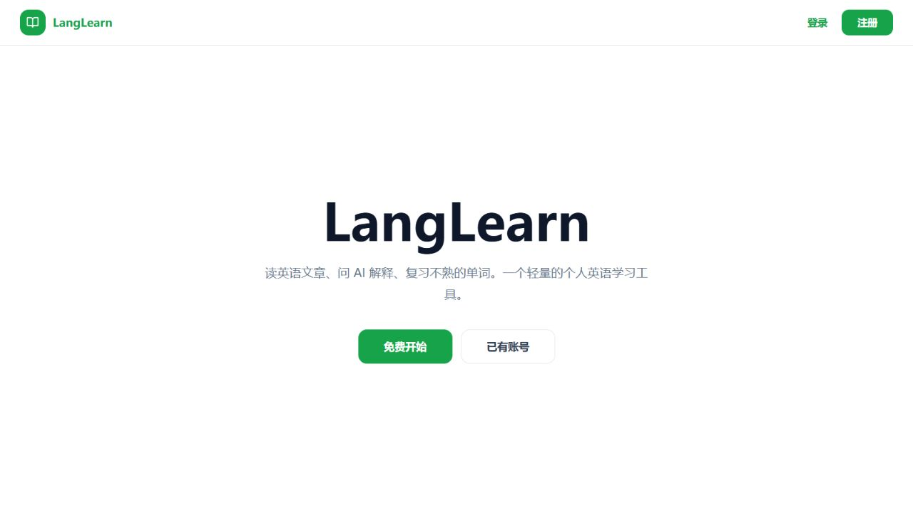
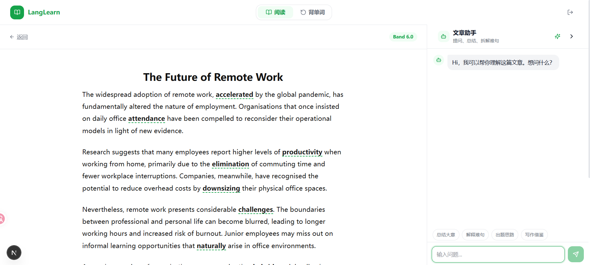
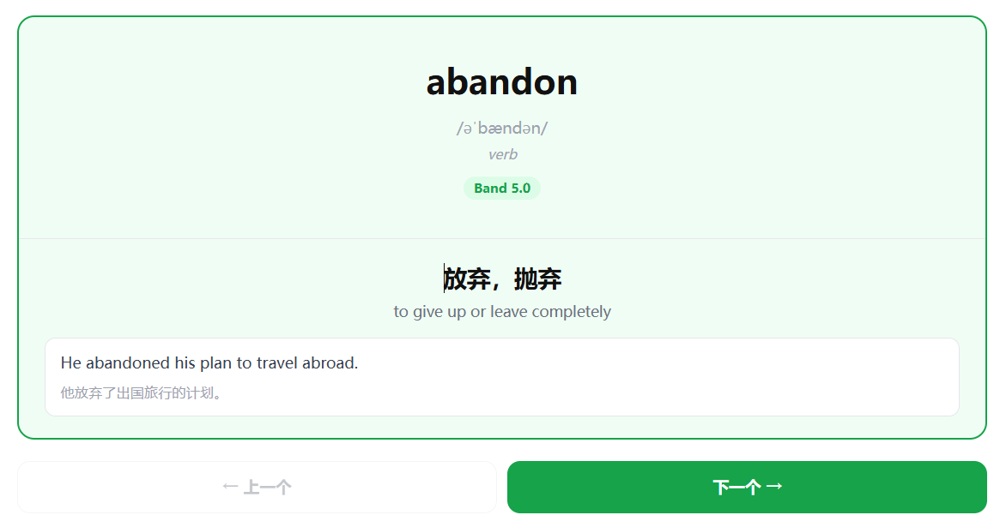

<div align="center">

# LangLearn

Read English articles, understand difficult passages, and remember useful vocabulary.

[Live demo](https://langlearn-cyan.vercel.app/) · [Deployment guide](DEPLOY.md)

</div>



LangLearn is a personal IELTS reading tool. It combines graded articles, quick word lookup, an article assistant, and spaced-repetition review in one focused workspace.

## Reading workspace



- Read IELTS passages from Band 6.0 to 9.0.
- Select a word or phrase to see its meaning and pronunciation.
- Ask the article assistant for a short explanation, translation, or summary.
- Generate a new passage and save it to your library.

## Vocabulary review



Review a curated set of 2,300+ CEFR B2-C2 words. Mark each card as remembered or forgotten, and LangLearn schedules the next review with SM-2 spaced repetition.

## Stack

- **Frontend:** Next.js, React, TypeScript
- **Backend:** FastAPI, SQLAlchemy, Alembic
- **Database:** PostgreSQL
- **Language help:** OpenAI API
- **Hosting:** Vercel, Railway, Neon

## Run locally

You need Docker and an OpenAI API key.

```bash
git clone https://github.com/kenlau5678/langlearn.git
cd langlearn
cp .env.example .env
```

Set `DB_PASSWORD`, `JWT_SECRET`, and `OPENAI_API_KEY` in `.env`, then start the app:

```bash
docker compose up --build
docker compose exec backend alembic upgrade head
```

Open [http://localhost:3000](http://localhost:3000). The API is available at [http://localhost:8000](http://localhost:8000).

## Deploy

The current setup uses Vercel for the frontend, Railway for the API, and Neon for PostgreSQL. See [DEPLOY.md](DEPLOY.md) for the required environment variables and first-deploy steps.
